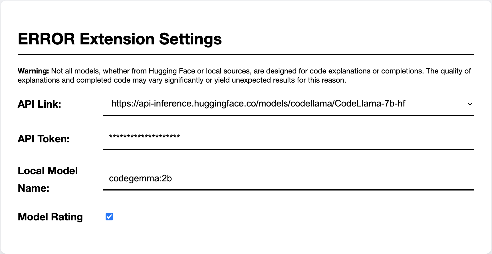
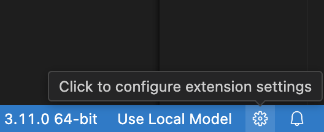
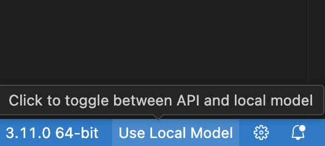
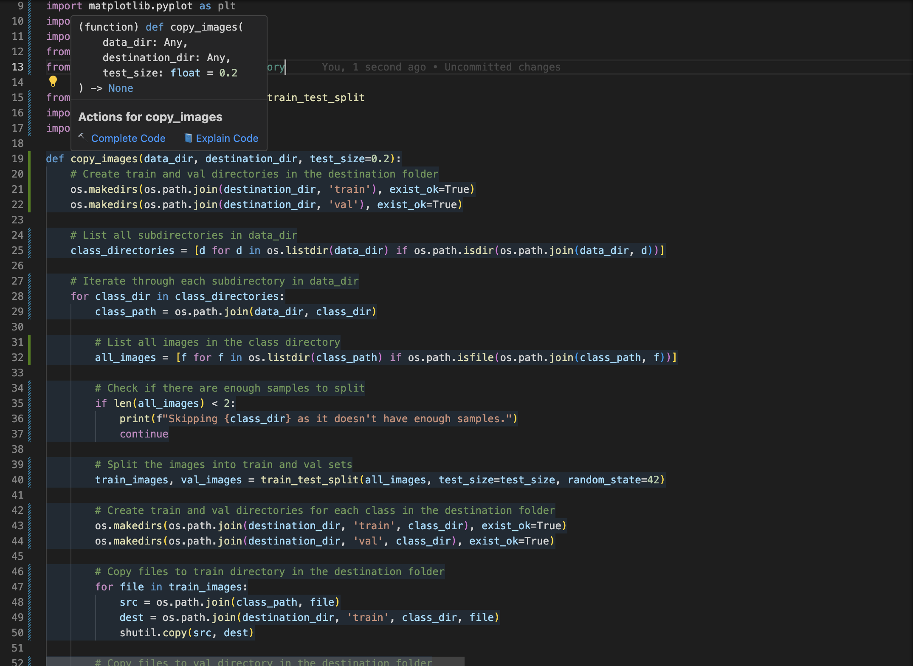
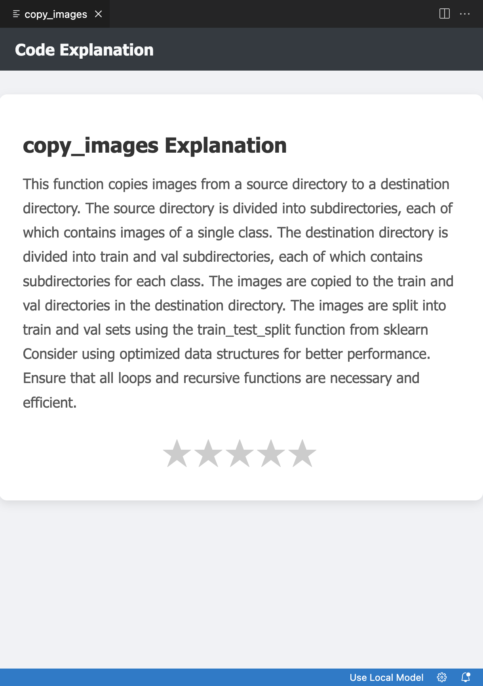
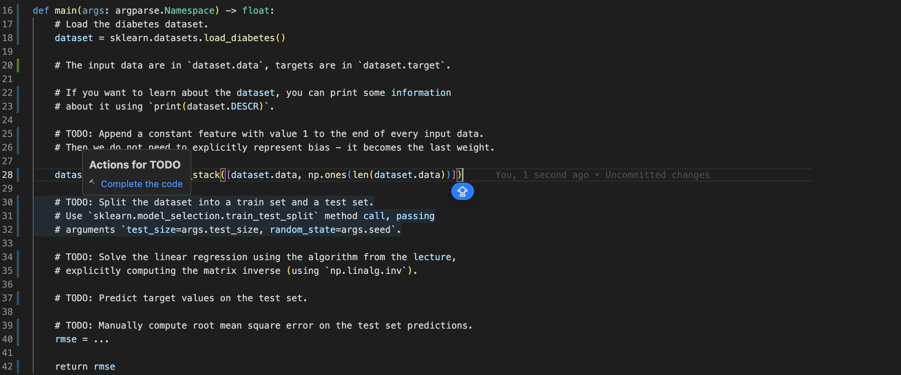
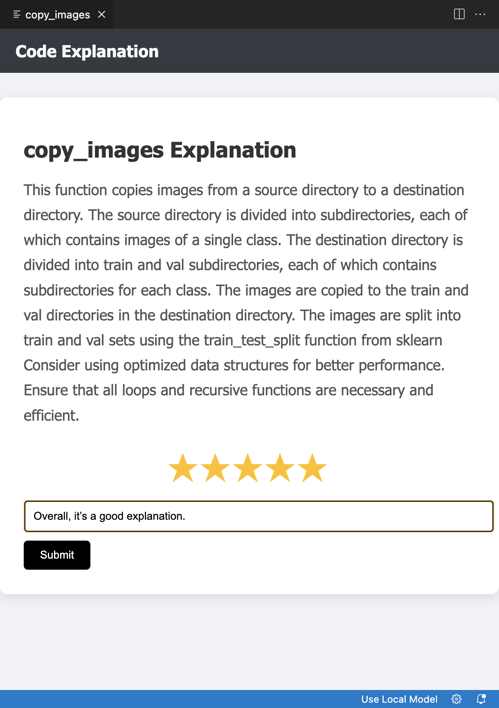

# ERROR
An advanced AI-powered developer tool for seamless code integration and comprehension.

## Description
**ERROR** is a Visual Studio Code extension designed to assist developers by providing real-time code explanations and completions using both local and external models. Designed to support both Python and JavaScript, **ERROR** enhances developer productivity by offering intuitive explanations of complex code snippets, thereby elevating coding efficiency and code quality.

## Features
- **Code Explanations**: Receive comprehensive explanations for any selected JavaScript or Python function or method. This feature not only clarifies complex algorithms but also suggests ways to improve code efficiency and maintain cleaner, more readable code.
- **Code Completion**: Automatically complete JavaScript or Python functions and methods, including support for enriching `Todo` comments with actionable code snippets.
- **Model Switching**: Seamlessly switch between using local models and those hosted on the Hugging Face API to best suit your development environment and needs.
- **Performance Rating**: Provide feedback on the utility of model-generated suggestions, aiding in the refinement of predictions and enhancements of the AI's accuracy.

## Requirements
- **Visual Studio Code** 1.89.0 or newer.
- **Hugging Face Account**: For API access.
- **Ollama**: Local model support.
- **Docker**: Recommended for containerizing the local environment to ensure consistency across different setups.

## Installation
#### Via VS Code Marketplace
Search for **ERROR** in the VS Code extensions marketplace and install it directly.

## Extension Settings

  

Configure **ERROR** to suit your development needs:

| Setting | Description |
|---------|-------------|
| `errorExtension.apiLink` | Define or modify the API URL used for connecting to the Hugging Face models or choose one from  predefined list |
| `errorExtension.apiToken` | Set or update the API token required for authentication with the Hugging Face API. |
| `errorExtension.modelName` | Specify or change the name of the model used for local usage. |
| `errorExtension.rateModelPerformance` |  Enable or disable the feature to rate the performance and effectiveness of the provided code suggestions. |

## Usage
Using the **ERROR** extension involves several straightforward steps to ensure you are set up and ready to enhance your coding experience with AI-powered code explanations and completions. Below is a guide to get you started:
### Step 1: Accessing Extension Settings
To configure the E.R.R.O.R extension for optimal use:
1. Click on the settings icon in the bottom right corner of Visual Studio Code, as shown below:
   

       
   

   

2. Navigate through the settings panel to adjust preferences for using either the local model or the Hugging Face API. Detailed guidance for each setting is available in the **Extension Settings** section of this document.

### Step 2: Switching Between Models
You can easily switch between using a local model and the Hugging Face API by clicking the toggle in the bottom right corner. See the toggle button depicted here:

    

### Step 3: Utilizing Code Explanation and Completion
To activate code explanations or completions:
1. Hover over a JavaScript or Python function or method declaration to highlight it. This action will display options for **Complete Code** and **Explain Code**.
   

   

1. Click **Explain Code** to initiate an analysis by the selected model, which will open in a new webview panel, showing detailed insights and suggestions for cleaner code, as illustrated here:

   

1. For code completion, especially for tasks annotated with `TODO` comments, select **Complete Code**. This feature extends the existing code or provides implementations based on the contextual comments. Here’s an example of the action triggered by a `TODO` comment:
   

   

### Step 4: Rating and Feedback
After receiving a code explanation or completion:
1. Rate the model's performance using the star system displayed at the bottom of the code explanation view.
2. Upon selecting a star rating, an input field will appear where you can submit comments for further improvement. This feedback is crucial for refining the model and enhancing the extension.

   

## Known Issues
**Model Limitations**: Not all models are suitable for code explanations or completions. The quality of the output from Hugging Face or local models can vary significantly, which may sometimes result in unexpected results.

## License
This project is licensed under the [MIT License](LICENSE).

## Credits
- [Hugging Face](https://huggingface.co): For providing an extensive range of models accessible via API.
- [Ollama](https://ollama.com): For the local model integration.
- [Docker](https://www.docker.com): For simplifying the setup process through containerization.

## Contact
For support or queries, reach out to Ibrahim Rahimli at [Email](mailto:rahimliibrahimm@gmail.com) or [GitHub Issues](https://github.com/ibrahimrl/ERROR/issues).
